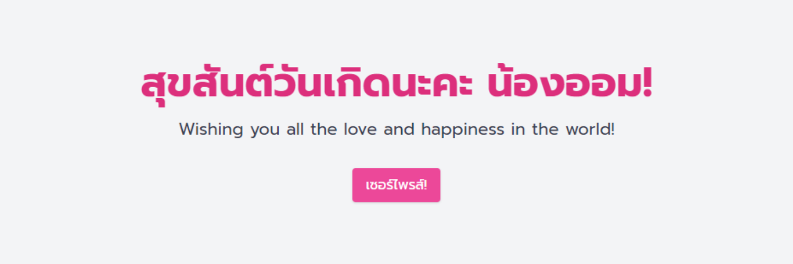

# Happy Birthday Wishes for NONG AOM! 💖

[](https://github.com/pyyupsk/happy-birthday/actions/workflows/pages/pages-build-deployment)

[](https://pyyupsk.github.io/happy-birthday/)

This special website is designed to celebrate NONG AOM's birthday with a heartfelt message and a fun surprise! Enjoy a joyful birthday message along with a virtual confetti celebration that appears when you click the "เซอร์ไพรส์!" button. 

Check out the birthday surprise website here: [Happy Birthday Wishes for NONG AOM!](https://pyyupsk.github.io/happy-birthday/)

## 💻 Features

- **Heartfelt Birthday Message:** A warm and personal message to make the day extra special.
- **Interactive Surprise:** Click a button to trigger a festive confetti animation.
- **Modal Window:** View the birthday message in a beautiful modal window with a close button.

## 📦 Installation

To run this project locally, follow these steps:

1. **Clone the Repository:**

   ```bash
   git clone https://github.com/pyyupsk/happy-birthday.git
   cd happy-birthday
   ```

2. **Open the `index.html` File:**

   Simply open the `index.html` file in your preferred web browser to view the website.

## 📋 Code Snippets

Here's a quick look at some of the HTML, CSS, and JavaScript used:

**HTML:**

```html
<h1 class="text-5xl font-bold mb-4 text-pink-600 animate-pulse">
  สุขสันต์วันเกิดนะคะ น้องออม!
</h1>
<button id="surpriseBtn" class="bg-pink-500 text-white px-4 py-2 rounded shadow hover:bg-pink-600 transition">
  เซอร์ไพรส์!
</button>
```

**CSS:**

```css
.confetti {
  position: absolute;
  width: 10px;
  height: 10px;
  background-image: linear-gradient(45deg, #ff004d, #ff8c00);
  opacity: 0.9;
  animation: confetti 2s infinite linear;
}
```

**JavaScript:**

```javascript
surpriseBtn.addEventListener("click", () => {
  modal.classList.remove("hidden");
  const confettiFrag = document.createDocumentFragment();
  for (let i = 0; i < 100; i++) {
    confettiFrag.appendChild(createConfetti());
  }
  confettiContainer.appendChild(confettiFrag);
  setTimeout(() => {
    confettiContainer.innerHTML = "";
  }, 10000);
});
```

## 📜 License

This project is for personal use and does not have a specific license. Feel free to use the code as you wish!